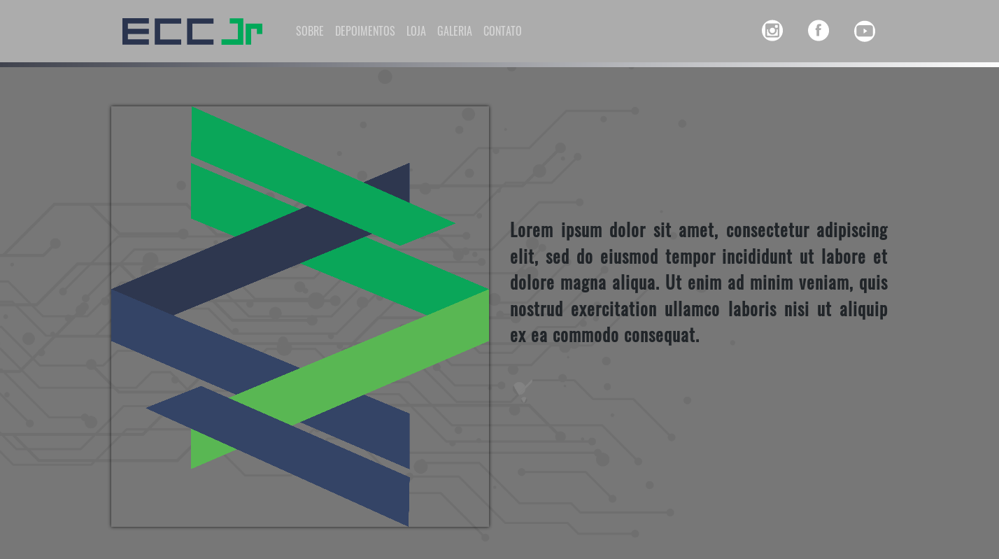

# Simple portfolio page written in Python Django

This is a portfolio page sample using Django and SQLite3. It uses image-cropping and embed YouTube/Soundcloud frame. The images are stock photos downloaded from https://www.pexels.com



## Follow the steps to run this project:

1. Clone this repository and create a virtual-env in the same directory
```sh
python3 -m venv venv
```

2. Activate your virtual-env:

Windows:
```sh
venv\Scripts\activate
```

Linux:
```sh
source venv/bin/activate
```

3. Install required Python modules
```sh
pip3 install -r requirements.txt
```

4. Finally run your server
```sh
python3 manage.py runserver
```

